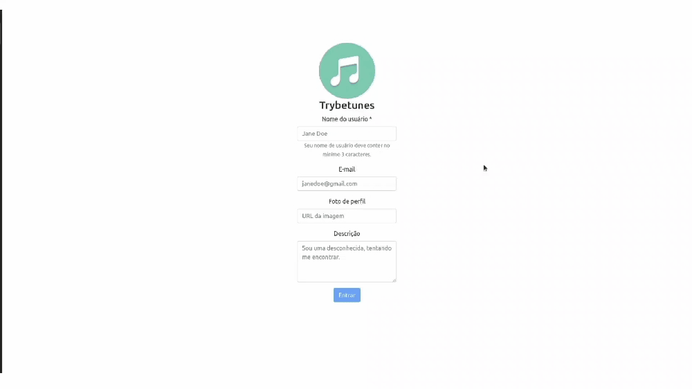

# Boas vindas ao repositório do projeto TrybeTunes!

#vqv 🚀

Aqui você vai encontrar os detalhes de como foi estruturado o projeto a partir desse repositório.

**Para acessar a aplicação em execução clique aqui (https://app-wendel-trybetunes.herokuapp.com/)**

---

# Sumário

- [Boas vindas ao repositório do projeto TrybeTunes!!](#boas-vindas-ao-repositório-do-projeto-trybetunes)
- [Sumário](#sumário)
- [Habilidades](#habilidades)
  - [O que foi desenvolvido](#o-que-foi-desenvolvido)
    - [Protótipo do projeto](#protótipo-do-projeto)
  - [Desenvolvimento](#desenvolvimento)
    - [Durante o desenvolvimento](#durante-o-desenvolvimento)
    - [ESLint e Stylelint](#eslint-e-stylelint)
- [Requisitos do projeto](#requisitos-do-projeto)

  - [1. Rotas necessárias para a aplicação](#1-rotas-necessárias-para-a-aplicação)

  - [2. Formulário para identificação](#2-formulário-para-identificação)

  - [3. Componente de cabeçalho](#3-componente-de-cabeçalho)

  - [4. Links de navegação no cabeçalho](#4-links-de-navegação-no-cabeçalho)

  - [5. Formulário para pesquisar artistas](#5-formulário-para-pesquisar-artistas)

  - [6. Requisição para pesquisar artistas](#6-requisição-para-pesquisar-artistas)

  - [7. Lista de músicas do álbum selecionado](#7-lista-de-músicas-do-álbum-selecionado)

  - [8. Mecanismo para adicionar músicas na lista de músicas favoritas](#8-mecanismo-para-adicionar-músicas-na-lista-de-músicas-favoritas)

  - [9. Mecanismo para remover músicas na lista de músicas favoritas](#9-mecanismo-para-remover-músicas-na-lista-de-músicas-favoritas)

  - [10. Lista de músicas favoritas](#10-lista-de-músicas-favoritas)

  - [11. Exibição de perfil](#11-exibição-de-perfil)

  - [12. Formulário de edição de perfil](#12-formulário-de-edição-de-perfil)

- [Depois de terminar o desenvolvimento](#depois-de-terminar-o-desenvolvimento)

---

# Habilidades
Neste projeto, você verá:

  * Requisições e consumo de dados vindos de uma `API`;

  * Ciclos de vida de um componente React;

  * Função `setState` de forma a garantir que um determinado código só é executado após o estado ser atualizado
  
  * Componente `BrowserRouter` corretamente;

  * Rotas, mapeando o caminho da URL com o componente correspondente, via `Route`;

  * `Switch` do `React Router`

  * Componente `Redirect` pra redirecionar para uma rota específica;

  * Llinks de navegação na aplicação com o componente `Link`;


---

## O que foi desenvolvido

Neste projeto foi desenvolvido o TrybeTunes, uma aplicação capaz de reproduzir músicas das mais variadas bandas e artistas, criar uma lista de músicas favoritas e editar o perfil da pessoa usuária logada. Essa aplicação será capaz de:

  - Fazer login;
  - Pesquisar por uma banda ou artista;
  - Listar os álbuns disponíveis dessa banda ou artista;
  - Visualizar as músicas de um álbum selecionado;
  - Reproduzir uma prévia das músicas deste álbum;
  - Favoritar e desfavoritar músicas;
  - Ver a lista de músicas favoritas;
  - Ver o perfil da pessoa logada;
  - Editar o perfil da pessoa logada;

### Protótipo do projeto

O projeto tem o comportamento de acordo com o do gif abaixo:



---

## Desenvolvimento

Nos últimos projetos desenvolvidos, por mais que o app tenha sido desenvolvido utilizando múltiplos componentes, o que é uma boa prática, todas as funcionalidades eram acessadas ao mesmo tempo, no mesmo lugar, utilizando apenas uma URL (`localhost:3000`, normalmente). A medida que seus apps se tornarem maiores e mais complexos, isso se tornará inviável. Desta vez, as funcionalidades do app serão agrupadas e organizadas em rotas.

Uma rota define o que deve ser renderizado na página ao abrí-la. Cada rota está associada a um caminho. O caminho é a parte da URL após o domínio (nome do site, de forma simplificada). Por exemplo, em `www.site.com/projetos/meu-jogo`, o caminho é `/projetos/meu-jogo`. Até agora, todos os apps React que eu desenvolvi possuíam somente uma rota, a raíz (`/`).

Outra diferença importante neste projeto em relação aos anteriores é que foi consumido e enviado dados para APIs para pesquisar a banda ou artista, recuperar as músicas de cada álbum e salvar as músicas favoritas, além de editar as informações da pessoa logada. Dessa forma, você terá que lidar com requisições assíncronas e promises. Também foram utilizados métodos de ciclo de vida (lifecycle methods) e de estados para controlar o que é renderizado por seus componentes dependendo do momento em que as requisições se encontram.

## Durante o desenvolvimento

* Foram feitos `commits` das alterações feitas no código regularmente;

* Após um ou alguns `commits` foi atualizado o repositório remoto (o famoso `git push`);

* Os comandos utilizados com mais frequência foram:

  1. `git status` _(para verificar o que está em vermelho - fora do stage - e o que está em verde - no stage)_;

  2. `git add` _(para adicionar arquivos ao stage do Git)_;

  3. `git commit` _(para criar um commit com os arquivos que estão no stage do Git)_;

  4. `git push -u nome-da-branch` _(para enviar o commit para o repositório remoto na primeira vez que fizer o `push` de uma nova branch)_;

  5. `git push` _(para enviar o commit para o repositório remoto após o passo anterior)_.

---

### ESLint e Stylelint

Para garantir a qualidade do código, foi utilizado neste projeto os linters `ESLint` e `Stylelint`.
Assim o código foi alinhado com as boas práticas de desenvolvimento, sendo mais legível
e de fácil manutenção! Para rodá-los localmente no projeto, foi executado os comandos abaixo:

```bash
  npm run lint
  npm run lint:styles
```

⚠️ Lembre-se esse projeto foi verificado passando pelos _checks_ do **linter**.

---

# Requisitos do projeto

## 1. Rotas necessárias para a aplicação
Foi utilizado o `BrowserRouter` pra criar as rotas da aplicação e cada rota renderiza um componente específico. Foi criado cada componente dentro da pasta `src/pages`, conforme o indicado abaixo:

- a rota `/` deve renderizar um componente chamado `Login`.

- a rota `/search` deve renderizar um componente chamado `Search`.

- a rota `/album/:id` deve renderizar um componente chamado `Album`.

- a rota `/favorites` deve renderizar um componente chamado `Favorites`.

- a rota `/profile` deve renderizar um componente chamado `Profile`.

- a rota `/profile/edit` deve renderizar um componente chamado `ProfileEdit`.

- para qualquer outra rota não mapeada, deve ser renderizado um componente chamado `NotFound`.

## 2. Formulário para identificação
Dentro do componente `Login`, que é renderizado na rota `/`, foi criado um formulário para que a pessoa usuária se identifique com um nome, e com dados opcionais de email, foto de perfil e descrição.
  
  * Foi criado um campo para que a pessoa usuária insira seu nome.

  * Foi criado um campo para que a pessoa usuária insira seu e-mail.

  * Foi criado um campo para que a pessoa usuária insira sua foto de perfil.

  * Foi criado um campo para que a pessoa usuária insira seu descrição.

  * Foi criado um botão com o texto `Entrar`.

  * O botão para entrar só deve ser habilitado caso o nome digitado tenha mais de 3 caracteres.

  * Enquanto a informação da pessoa usuária é salva, uma mensagem com o texto `Carregando...` deve aparecer na tela.

  * Após a informação ter sido salva, há um redirect para a rota `/search`.
  
## 3. Componente de cabeçalho
Foi criado um componente chamado `Header`, dentro da pasta `src/components`.

  * Foi criado esse componente com a tag `header` envolvendo todo seu conteúdo;

  * O componente de cabeçalho é renderizado nas páginas das rotas `/search`, `/album/:id`, `/favorites`, `/profile` e `/profile/edit`; 

  * A função `getUser` da `userAPI` recupera os dados da pessoa logada.

  * Enquanto estiver aguardando a resposta da `getUser`, a mensagem de `Carregando...` é exibida na tela.

## 4. Links de navegação no cabeçalho

  * Foi criado o link que redireciona para a página de pesquisa dentro do componente `Header`.

  * Foi criado o link que redireciona para a página de músicas favoritas dentro do componente `Header`.

  * Foi criado o link que redireciona para a página de exibição de perfil dentro do componente `Header`.

## 5. Formulário para pesquisar artistas
Este formulário contem um input e um botão para que seja possível pesquisar os álbums de uma banda ou artista. Foi criado o formulário dentro do componente `Search`, que é renderizado na rota `/search`.
    
  * Foi criado um campo para pessoa digitar o nome da banda ou artista a ser pesquisada.
  
  * Foi criado um botão com o texto `Pesquisar`.

  * O botão só deve estar habilitado caso o nome do artista tenha 2 ou mais caracteres.

## 6. Requisição para pesquisar artistas
Com a estrutura da tela de pesquisa criada, agora é hora de fazer uma requisição e receber a lista de álbums da banda ou artista pesquisada.

  * Ao clicar no botão de `Pesquisar`, o valor do input é limpo e é feito uma requisição utilizando a função do arquivo `searchAlbumsAPIs.js`.

  * Enquanto aguarda a resposta da API, o input e o botão de pesquisa são escondidos e a mensagem `Carregando...` é exibida na tela.

  * Após receber a resposta da requisição é exibido na tela o texto `Resultado de álbuns de: <artista>`, onde `<artista>` é o nome que foi digitado no input.

  * É listado os álbuns retornados. A API irá retorna um *array* de objetos.

  * Ao listar os álbuns, foi criado um link em cada card para redirecionar para a página do álbum.

  * Este link deve redirecionar para a rota `/album/:id`, onde `:id` é o valor da propriedade `collectionId` de cada Álbum da lista recebida pela API.

  * Se nenhum álbum for encontrado para o nome pesquisado, a API irá retornar um array vazio. Nesse caso, a mensagem `Nenhum álbum foi encontrado` deverá ser exibida.

## 7. Lista de músicas do álbum selecionado
Agora que está tudo pronto, você poderá exibir a lista de músicas do álbum selecionado. Foi criada a lista dentro do componente `Album`, que é renderizado na rota `/album/:id`.
  
  * Ao entrar na página, é feito uma requisição utilizando a função `getMusics` do arquivo `musicsAPI.js`.

  * É exibido o nome da banda ou artista na tela.

  * É exibido o nome do álbum e nome da banda ou artista na tela.

  * É listado todas as músicas do álbum na tela. Para isso, foi criado um componente chamado `MusicCard` que deverá exibir o nome da música (propriedade `trackName` no objeto recebido pela API) e um player para tocar o preview da música (propriedade `previewUrl` no objeto recebido pela API).

  Para tocar o preview, foi usada a tag `audio` do próprio HTML. Sua implementação é assim: 
  ```javascript
  <audio data-testid="audio-component" src={ previewUrl } controls>
    <track kind="captions" />
      O seu navegador não suporta o elemento <code>audio</code>.
  </audio>
  ```

## 8. Mecanismo para adicionar músicas na lista de músicas favoritas
Você já consegue listar as músicas dos álbuns, nessa etapa você poderá marcar quais são as músicas que você mais gosta.

  * No componente `MusicCard`, foi criado um input do tipo `checkbox` para marcar as músicas favoritas.

  * Para adicionar uma música a lista de favoritas, foi utilizada a função `addSong` da `favoriteSongsAPI`.

  * Enquanto aguarda o retorno da função `addSong`, a mensagem de `Carregando...` é renderizada na tela.

  * Ao entrar na página, foi utilizada a função `getFavoriteSongs` da `favoriteSongsAPI` para recuperar a lista de músicas que já foram favoritadas.


## 9. Mecanismo para remover músicas na lista de músicas favoritas
Depois de listar e favoritar as músicas de um álbum, você também pode remover uma música da lista de favoritas.

  * Ao clicar em uma música que já está marcada como favorita, ela deve ser removida da lista de músicas favoritas.

  * Enquanto aguarda o retorno da função `removeSong`, a mensagem de `Carregando...` é exibida na tela.


## 10. Lista de músicas favoritas
Foi criada a lista dentro do componente `Favorites`, que é renderizado na rota `/favorites`.

  * Ao entrar na página, foi utilizada a função `getFavoriteSongs` da `favoriteSongsAPI` para recuperar a lista de músicas favoritas.

  * Enquanto aguarda a resposta da API, a mensagem `Carregando...` é exibida.

  * Após receber o retorno da função `getFavoriteSongs`, foi utilizado o  componente `MusicCard` para renderizar a lista de músicas favoritas.

  * Nesta página deve ser possível desfavoritar as músicas. Para isso foi utilizada a função `removeSong` da `favoriteSongsAPI`.

  * Enquanto aguarda a resposta da API, a mensagem `Carregando...` é exibida na tela.

  * Após remover a música, é atualizada a lista usando a função `getFavoriteSongs`. É exibido a mensagem `Carregando...` enquanto aguarda o retorno da API.

## 11. Exibição de perfil
Foi criada a exibição do perfil dentro do componente `Profile`, que é renderizado na rota `/profile`.

  * Foi utilizado a função `getUser` da `userAPI` para recuperar as informações da pessoa logada.

  * Enquanto aguarda a resposta da API, a mensagem `Carregando...` é exibida na tela.

  * Após receber o retorno da `getUser`, são exibidos o nome, o email, a descrição e a imagem da pessoa logada.

  * Foi criado um link que redireciona para a página de edição de perfil (rota `/profile/edit`).

## 12. Formulário de edição de perfil
Foi criado o formulário de edição de perfil dentro do componente `ProfileEdit`, que é renderizado na rota `/profile/edit`.

  * Foi utilizado a função `getUser` da `userAPI` para recuperar as informações da pessoa logada.

  * Enquanto aguarda a resposta da API, a mensagem "Carregando..." é exibida na tela.

  * Após receber as informações da pessoa logada, é renderizado um formulário já preenchido com os seguintes campos:

    * Um campo para alterar o nome da pessoa usuária.

    * Um campo para alterar o email da pessoa usuária.

    * Um campo para alterar a descrição da pessoa usuária.

    * Um campo para alterar a foto da pessoa usuária.

    * Um botão para salvar as informações alteradas.

  * Para poder habilitar o botão de enviar, todos os campos precisam estar preenchidos (não podem estar vazios).

  * O campo de email, além de não estar vazio também é verificado que o email tem um formato válido, ou seja, deve seguir o padrão `test@test.com`.
  
  * O botão de salvar as informações só deve ser habilitado quando todos os campos estiverem válidos, ou seja, todos campos preenchidos e o campo de email com um valor em formato válido.

  * Quando o botão estiver habiltado, foi utilizado a função `updateUser` da `userAPI` para atualizar as informações da pessoa usuária.

  * Enquanto aguarda a resposta da API, a mensagem `Carregando...` é exibida na tela.

  * Ao finalizar o processo de edição, a pessoa logada é redirecionada para a página de exibição de perfil (rota `/profile`).

---

## Depois de terminar o desenvolvimento

O projeto foi concluído e está em _"Code Review"_ em meu _Pull Request_, aceito feedbacks.

---
